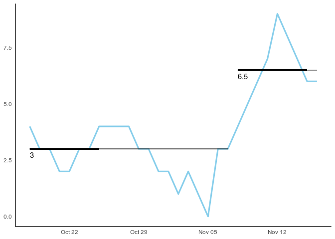

<!-- README.md is generated from README.Rmd. Please edit that file -->
runchart
--------

Run charts are one of the fundamental tools of quality improvement. runchart is designed to make it quick and easy to create run charts. Learn more in `vignette("runchart")` or `?runchart`.

A number of R packages exist to automate statistical process control charts. For example:

-   [qicharts2](https://anhoej.github.io/qicharts2/)
-   [qcc](https://cran.r-project.org/web/packages/qcc/index.html)
-   [ggQC](https://cran.r-project.org/web/packages/ggQC/index.html)

The runchart package is different from the above because it focusses solely on run charts and provides the ability to automatically rephase baselines. The package exports a single easy to use function `runchart()`.

Installation
------------

runchart is not currently available from CRAN, but you can install the development version from github with:

``` r
# install.packages("devtools")
devtools::install_github("jsphdms/runchart")
```

Usage
-----

Format your data into a dataframe with two columns: date and value. Then feed it into the `runchart()` function. By default shifts and trends are displayed (triggering at 6 and 5 consecutive points respectively) and the baseline is not rephased. These defaults can be changed to suit your methodology.

``` r
library(runchart)
library(ggplot2)

value <- as.numeric(LakeHuron)
df <- data.frame(date  = seq.Date(Sys.Date(), by = "day", length.out = length(value)),
                 value = value)
runchart(df)
```


