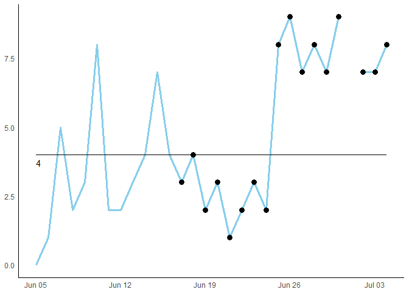

<!-- README.md is generated from README.Rmd. Please edit that file -->
Please note
-----------

This package is under construction; functionality may change. If this project is of interest to you please get in touch; I'm keen to hear feedback and may be able to incorporate your specific needs into the package.

Introduction
------------

> Because they are simple to make and relatively straightforward to interpret, run charts are one of the most useful tools in quality improvement. - [NHS Scotland Quality Improvement Hub](http://www.qihub.scot.nhs.uk/knowledge-centre/quality-improvement-tools/run-chart.aspx).

Run charts[1] are non-trivial to automate. A number of solutions exist in the healthcare improvement community in Scotland. However the author is only aware of small-scale solutions such as scripts and Excel macros.

These kinds of approaches have the following limitations:

-   Version control is cumbersome and unrealistic.
-   Adding a separate script to an existing workflow is inconvenient and error prone.
-   Scripts are often written to operate under specific conditions; making wider adoption unlikely.
-   Testing edge cases is a time consuming task which is replicated with each new script or macro.

The `runchart` package aims to overcome these limitations by exporting a small number of easy to use and well tested functions.

Getting Started
---------------

To download the package first ensure you are not behind a firewall or using a VPN[2]. Install the package using `install_github()`[3]:

    devtools::install_github('josephjosephadams/runchart')

The easiest place to start is with `rc_plot()`. This function takes a data frame with two columns: date and value:

``` r
library(runchart)
library(ggplot2)

set.seed(0)

n     <- 30
date  <- seq.Date(Sys.Date(), by = "day", length.out = n)
value <- c(0,1,5,2,3,8,2,2,3,4,7,4,3,4,2,3,1,2,3,2,8,9,7,8,7,9,NA,7,7,8)

df    <- data.frame(date  = date,
                    value = value)

rc_plot(df)
```



Things to Notice
----------------

There are several behaviours to notice in the plot above:

-   **Rephasing** for each sustained shift (9 consecutive points all above/below the baseline).

-   **Shifts** are identified (6 or more consecutive points all above/below the baseline).

-   **Missing values** are ignored. For example the 27th data point above is missing, which causes the rephased baseline to be longer than the first.

-   **Non-useful observations** are ignored. For example the 15th data point above lands exactly on the first baseline. Therefore it neither breaks nor contributes to the observed shift.

The functions exported by the `runchart` package have been well tested using the `testthat` package to correctly handle such different scenarios and edge cases.

Going Further
-------------

If you need the fields that sit behind the run chart plot: use `rc_fields()`:

``` r
head(rc_fields(value))
#>   base base_ext base_label shift val
#> 1    2        2          2    NA   0
#> 2    2        2         NA    NA   1
#> 3    2        2         NA    NA   5
#> 4    2        2         NA    NA   2
#> 5    2        2         NA    NA   3
#> 6    2        2         NA    NA   8
```

The columns `base` and `base_ext` are used for the thick and thin black lines in the plot above. The `base_label` column is used for labelling new baselines. The `shift` and `val` columns are used to plot shifts and the original data.

Different Methodologies
-----------------------

There is no fixed methodology for creating run charts. Here are some functions which should help you apply a range of methodologies.

### Single Baseline

If you require a single baseline with shifts and trends, you can use the `basic_shift()` and `basic_trend()` functions:

``` r
base = median(value, na.rm = T)

basic_shift(base = base, val = value)
#>  [1] 13 15 16 17 18 19 20 21 22 23 24 25 26 28 29 30
basic_trend(val = value)
#> [1]  8 29
```

[1] As defined by the NHS Scotland Quality Improvement Hub

[2] These can block installation from GitHub

[3] You may need to install the `devtools` package first.
